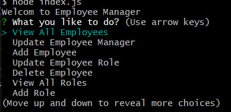

# Employee-Data-Tracker

App to track data of the company's employis

## Description

In this project I wanted to create back end application that can store data of the company's employees. I wanted to add different functionality like :
- Displaying all employee's data as a table
- Ability to add or delete employee to the data base
- Ability to change employee's manager or role in the company
- Displaying all roles that present in the company
- Ability to add new or delete existing role to the existing department
- Displaying all departments in the company
- Ability to add new or delete existing department 

## Table of Contets

- [Screenshots](#screenshots)
- [Links](#links)

## Screenshots

In this section I provided screenshots of the  Application's functionality.

## Links

In this section I added links to the video of application and to the GitHub repositories with the original codebase.

The URL of the video:
    https://www.youtube.com/watch?v=5OnyQsH1sjU

Original Code Repository:
    https://github.com/MykhailoZakh/Employee-Data-Tracker